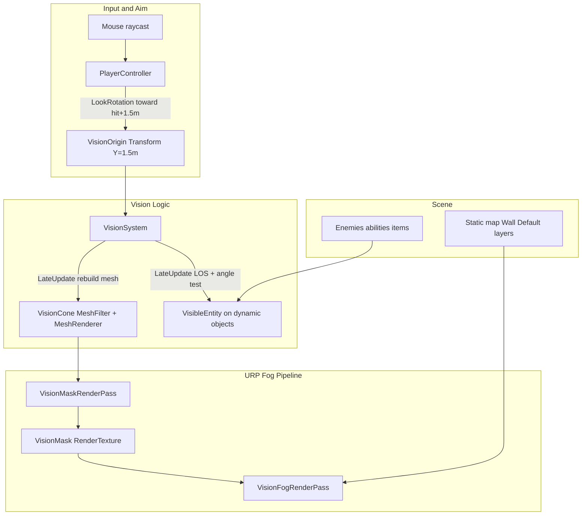

# Vision System Implementation Plan

## Why previous attempts failed

Your project already has most of the **logic** in place, but the **visual fog-of-war path is broken** in three ways:

1. **[VisionMask.shader](Assets/Shaders/Vision/VisionMask.shader) is Built-in RP syntax** — it has no URP `HLSLPROGRAM` pass, so in Unity 6 + URP it typically renders pink/missing or never writes stencil correctly.
2. **The working scene setup lives in [_Recovery/0.unity](Assets/_Recovery/0.unity), not your main scene** — `VisionOrigin`, `VisionCone`, and `FogOfWarShroud` are wired there; [SampleScene.unity](Assets/Scenes/SampleScene.unity) has no vision objects (and is binary, harder to diff).
3. **Configuration mismatches your spec** — recovery scene uses `viewAngle: 60`, `viewRadius: 15`, and `obstacleMask` includes **Ground** (layer 7), which makes the cone hit the floor immediately instead of extending to walls.

The **entity-hiding half** (`VisibleEntity` + `FindVisibleEntities3D`) is structurally correct; the **fog-of-war half** needs the post-process approach you selected.

---

## Target behavior (your spec)


| Element          | Rule                                                                                                             |
| ---------------- | ---------------------------------------------------------------------------------------------------------------- |
| Cone apex        | Player feet + **1.5 m** (`VisionOrigin` local Y)                                                                 |
| Cone aim         | From apex toward **mouse world hit + 1.5 m** (3D pitch for ledges/pits)                                          |
| Opening angle    | **70°** total (±35° from center axis)                                                                            |
| Range            | Raycast each cone direction until **Wall / prop** hit; use a large max distance (e.g. 500 m), not a short radius |
| Static geometry  | Always rendered; **darkened outside cone**                                                                       |
| Dynamic entities | **Fully hidden** outside cone (players, abilities, spike, etc.)                                                  |


---

## Architecture (components and connections)




### Component reference


| Component                | Location                                                                        | Responsibility                                                                                                                                            |
| ------------------------ | ------------------------------------------------------------------------------- | --------------------------------------------------------------------------------------------------------------------------------------------------------- |
| **VisionOrigin**         | Child of Player, `localPosition (0, 1.5, 0)`                                    | Apex of the cone; rotated every frame by `PlayerController`                                                                                               |
| **PlayerController**     | [PlayerController.cs](Assets/Scripts/Player/PlayerController.cs)                | Mouse raycast → `lookTarget = hit.point + Vector3.up * 1.5f`; body Y-rotation; `visionOrigin.rotation = LookRotation(lookTarget - visionOrigin.position)` |
| **VisionSystem**         | [VisionSystem.cs](Assets/Scripts/Vision/VisionSystem.cs) on Player              | Builds 3D cone mesh via raycasts; runs dynamic visibility tests                                                                                           |
| **VisionCone**           | Child of VisionOrigin                                                           | `MeshFilter` + `MeshRenderer` (mesh only — no longer used for stencil)                                                                                    |
| **VisibleEntity**        | [VisibleEntity.cs](Assets/Scripts/Vision/VisibleEntity.cs) on enemies/abilities | Disables child `Renderer`s when outside cone                                                                                                              |
| **VisionMaskRenderPass** | New URP `ScriptableRendererFeature`                                             | Renders cone mesh into a mask RT (white = visible)                                                                                                        |
| **VisionFogRenderPass**  | Same feature, second pass                                                       | Fullscreen blit: darken pixels where mask is black                                                                                                        |
| **FogOfWarShroud plane** | **Remove**                                                                      | Replaced by fullscreen post pass (fixes zoom/height issues)                                                                                               |


**Execution order per frame:**

1. `PlayerController.Update` — aim `VisionOrigin`
2. Normal URP opaque pass — world draws at full brightness
3. `VisionSystem.LateUpdate` — rebuild cone mesh + update `VisibleEntity`
4. `VisionMaskRenderPass` — draw cone silhouette into `_VisionMaskRT`
5. `VisionFogRenderPass` — composite dark overlay using mask
6. UI draws on top

---

## Part 1 — Scene and layer setup

### Player hierarchy (create in main scene or prefab)

```
Player
├── VisionOrigin          (Transform only, local Y = 1.5)
│   └── VisionCone        (MeshFilter, MeshRenderer, Layer = VisionCone)
├── PlayerController      (visionOrigin ref → VisionOrigin)
├── VisionSystem          (visionOrigin ref, viewMeshFilter → VisionCone)
└── ... (Health, WeaponController, etc.)
```

### Layers ([TagManager.asset](ProjectSettings/TagManager.asset) already has Wall=6, Ground=7)


| Layer                        | Used for       | In obstacle raycasts?                    |
| ---------------------------- | -------------- | ---------------------------------------- |
| **Wall** (6)                 | Walls, boxes   | **Yes** — blocks cone                    |
| **Default** (0)              | Props, dummies | **Yes**                                  |
| **Ground** (7)               | Floors         | **No** — floor must not clip cone        |
| **VisionCone** (new, e.g. 8) | Cone mesh only | **No** — excluded from gameplay raycasts |


Assign map floors to **Ground**; walls to **Wall**. Add `VisibleEntity` to `TargetDummy`, `Spike` prefab, and future players/abilities.

Wire `PlayerController.visionOrigin` and `VisionSystem.visionOrigin` to the same transform (already done in recovery scene).

---

## Part 2 — Fix VisionSystem logic

Edit [VisionSystem.cs](Assets/Scripts/Vision/VisionSystem.cs):

**Constants to set (Inspector or serialized defaults):**

- `viewAngle = 70`
- `maxViewDistance = 500` (rename from `viewRadius` — semantic clarity)
- `obstacleMask = Wall | Default` (exclude Ground and VisionCone)
- `entityMask = Default` (or a dedicated `Dynamic` layer later)

**Cone mesh generation (keep current spherical sweep, fix config):**

- Apex at `visionOrigin.position`; directions in **world space** from `visionOrigin.forward`
- For each direction on the 70° cone surface: `Physics.Raycast(origin + dir * 0.05f, dir, maxViewDistance, obstacleMask)`
- If no hit, vertex at `origin + dir * maxViewDistance`
- Assign mesh to `VisionCone` MeshFilter each `LateUpdate`

**Dynamic visibility (`FindVisibleEntities3D`):**

- Use `maxViewDistance` for `OverlapSphere` center at `visionOrigin.position`
- Target point: entity position + `Vector3.up * 1.5f` (eye height)
- Visible if:
  - `Vector3.Angle(visionOrigin.forward, dirToTarget) <= viewAngle / 2`
  - `!Physics.Raycast(visionOrigin.position, dirToTarget, dist - 0.1f, obstacleMask)`
- Call `visibleEntity.SetVisible(true/false)`

**Optional debug:** semi-transparent cone material on a separate debug layer; toggle in Inspector.

**Remove** the line that reparents `viewMeshFilter` in `Start()` — keep `VisionCone` as a stable child of `VisionOrigin`.

---

## Part 3 — PlayerController aim (mostly done)

[PlayerController.cs](Assets/Scripts/Player/PlayerController.cs) lines 96–149 already implement your aim rule:

```csharp
lookTarget = hit.point + Vector3.up * 1.5f;
Vector3 visionDir = lookTarget - visionOrigin.position;
visionOrigin.rotation = Quaternion.LookRotation(visionDir);
```

**Small improvement:** extract `eyeHeight = 1.5f` as a shared constant (or ScriptableObject) used by both `PlayerController` and `VisionSystem` so apex and look target stay in sync.

**Body rotation** stays Y-only (horizontal); only `VisionOrigin` pitches — correct for top-down tactical feel.

---

## Part 4 — URP post-process fog (replaces stencil + shroud)

You chose render-texture + fullscreen pass. This is the reliable URP path.

### New files


| File                                                | Purpose                                              |
| --------------------------------------------------- | ---------------------------------------------------- |
| `Assets/Scripts/Vision/VisionFogRendererFeature.cs` | URP feature registering two passes                   |
| `Assets/Scripts/Vision/VisionMaskRenderPass.cs`     | Renders VisionCone layer to mask RT                  |
| `Assets/Scripts/Vision/VisionFogRenderPass.cs`      | Fullscreen darken using mask                         |
| `Assets/Shaders/Vision/VisionMaskDraw.shader`       | URP Unlit: outputs white, ZTest Always, no lighting  |
| `Assets/Shaders/Vision/VisionFogComposite.shader`   | Samples `_CameraColorTexture` + `_VisionMaskTexture` |


### Pass 1 — Mask RT

- Allocate `RenderTexture` (R8 or `_VisionMask`, screen size or half-res)
- Clear to **black** (outside cone)
- `RenderStateBlock` + `DrawingSettings`: render all objects on **VisionCone** layer with `VisionMaskDraw` override material → **white**
- Use main camera view/projection matrices so the mask matches what the player sees

### Pass 2 — Fog composite

- Inject at `RenderPassEvent.AfterRenderingTransparents` (before UI)
- Blit camera color through `VisionFogComposite`:
  ```hlsl
  float mask = SAMPLE_TEXTURE2D(_VisionMaskTex, sampler, uv).r;
  float4 scene = SAMPLE_TEXTURE2D(_CameraOpaqueTexture or _CameraColorTexture, ...);
  float fogStrength = 0.65; // tune in Inspector
  return lerp(scene, scene * (1.0 - fogStrength), 1.0 - mask);
  ```
- Result: static walls/floors remain visible but dimmed outside cone; inside cone unchanged

### Renderer setup

- Add `VisionFogRendererFeature` to [PC_Renderer.asset](Assets/Settings/PC_Renderer.asset)
- Expose `_FogStrength`, `_MaskDownscale` on the feature
- **Delete or disable** `FogOfWarShroud` scene object and retire [FogShroud.shader](Assets/Shaders/Vision/FogShroud.shader) / old [VisionMask.shader](Assets/Shaders/Vision/VisionMask.shader)

### Why this beats the old shroud plane

- Works at **any camera height** (your zoom goes Y=12→100 in [TopDownCamera.cs](Assets/Scripts/Camera/TopDownCamera.cs))
- No Z-fighting between horizontal plane and map geometry
- No stencil buffer dependency (URP stencil is finicky with transparent ordering)

---

## Part 5 — Wire dynamic entities

Add [VisibleEntity.cs](Assets/Scripts/Vision/VisibleEntity.cs) to every **dynamic** object:

- `TargetDummy`
- [Spike.prefab](Assets/Prefabs/Spike.prefab) (already has it in recovery)
- Future player models, ability VFX roots, dropped weapons

Set `visualRoot` to the mesh/VFX child if the root has colliders only.

**Do not** add `VisibleEntity` to static map geometry — fog pass handles those.

---

## Part 6 — Verification checklist


| Test                         | Expected                                       |
| ---------------------------- | ---------------------------------------------- |
| Aim at floor vs elevated box | Cone tilts up/down; mesh follows mouse + 1.5 m |
| Stand near wall              | Cone stops at wall surface, not at floor edge  |
| Walk behind wall             | Enemy dummy disappears (`VisibleEntity`)       |
| Pan camera zoom              | Fog edge stays aligned with cone (no whiteout) |
| Outside cone                 | Walls/floors visible but ~65% darker           |
| Inside cone                  | Full brightness; enemies visible               |
| FOV angle                    | ~70° total opening                             |


---

## Suggested implementation order

1. **Scene wiring** — Player hierarchy + layers in main scene
2. **VisionSystem config** — 70°, 500 m, obstacle mask without Ground
3. **Confirm entity hiding** — dummy appears/disappears (no fog yet)
4. **URP mask + fog passes** — post-process darkening
5. **Remove old shroud/stencil assets** — avoid dual systems fighting
6. **Tune** fog strength, mesh resolution (`horizontalResolution` / `verticalResolution`)

---

## Future extensions (not in this pass)

- **Smokes:** smoke volume blocks LOS raycasts + carves holes in mask
- **Blind:** force all `VisibleEntity` hidden; static fog unchanged
- **Team vision toggle:** merge teammate mask RTs with OR
- **Ability reveal (Sova):** temporarily force `SetVisible(true)` on scanned enemies

These plug into the same `VisionSystem` visibility query and mask RT without redesign.